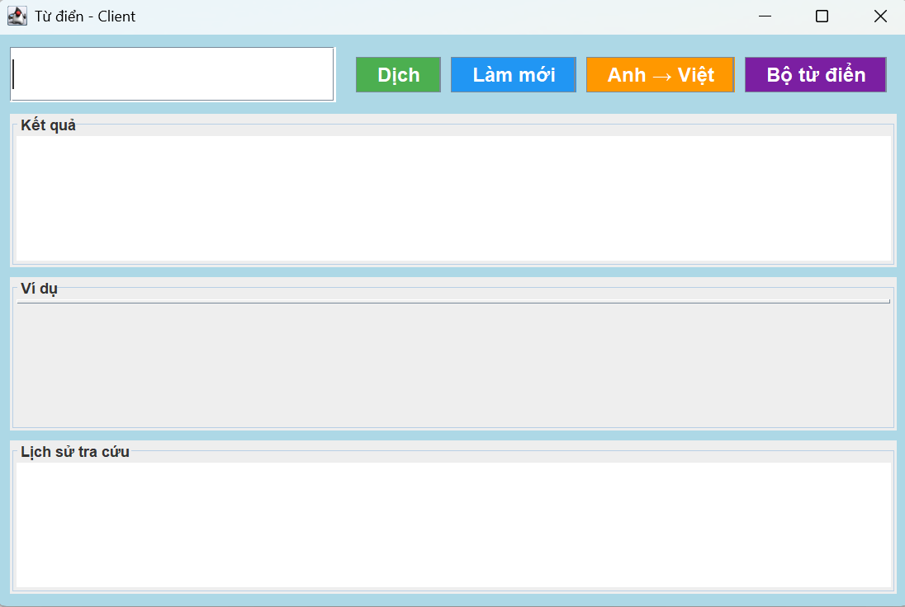
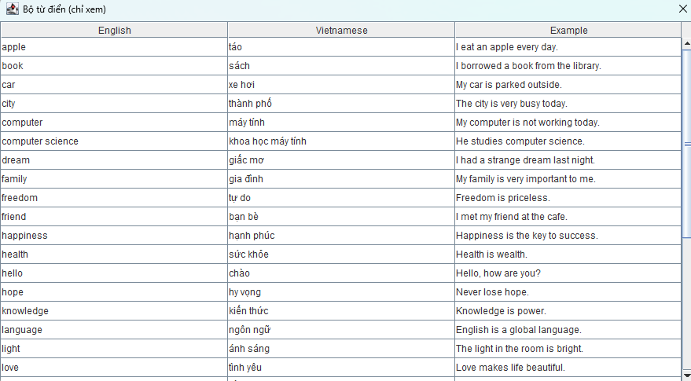
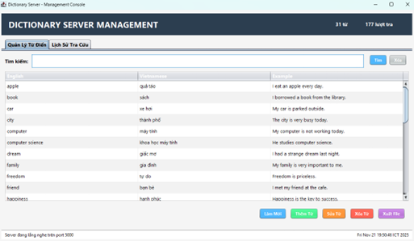
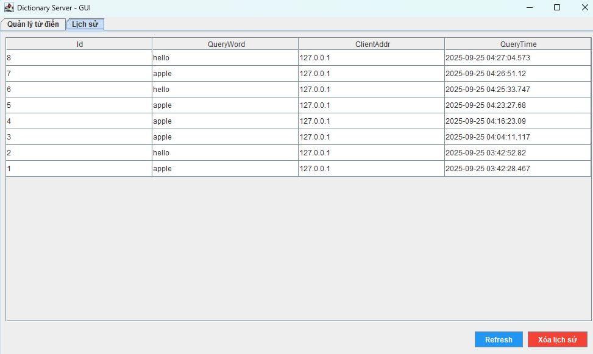

<h2 align="center">
    <a href="https://dainam.edu.vn/vi/khoa-cong-nghe-thong-tin">
    🎓 Faculty of Information Technology (DaiNam University)
    </a>
</h2>
<h2 align="center">
   ỨNG DỤNG HỖ TRỢ TRA CỨU SONG NGỮ ANH-VIỆT. 
</h2>
</h2>

    

        
        
        
    

---

## 📖 1. Giới thiệu.

Ứng dụng được xây dựng theo mô hình **Client–Server**, với các đặc điểm chính:
- **Giao diện:** phát triển bằng **Java Swing**.  
- **Mạng:** trao đổi dữ liệu thông qua **TCP Socket**.  
- **Dữ liệu:** lưu trữ tập trung tại **Server** dưới dạng **SQL Database**.  

Mục tiêu của hệ thống là mang lại trải nghiệm tra cứu từ điển **nhanh chóng, chính xác và thân thiện**, tương tự như Google Dịch nhưng gọn nhẹ hơn.

### ⚡ Các tính năng nổi bật.
- **Tra cứu song ngữ.**  

- **Ví dụ ngữ cảnh thực tế.**  

- **Lịch sử tra cứu.**  

---

## 🔧 2. Công nghệ sử dụng. 

---

## 🖼️ 3. Hình ảnh hệ thống.

<small><em>Giao diện người dùng</em></small>

        
        

        
<small><em>Giao diện bộ từ điển</em></small>

        

                
                

                
<small><em>Giao diện quản lý</em></small>

                

                        
                        

                        
<small><em>Giao diện lịch sử</em></small>

                        

                                
                                

                                ---

                                ## ⚙️ 4. Các bước cài đặt.

                                Yêu cầu hệ thống

                                - Java JDK 8 trở lên.
                                - SQL Server 2019/2017/2016.
                                - Eclipse hoặc IDE Java tương thích.
                                - Thư viện JDBC SQL Server.

                                Bước 1: Thiết lập cơ sở dữ liệu

                                1. Mở SQL Server Management Studio (SSMS).
                                2. New Query rồi copy file setup_database vào để tạo database và bảng mẫu.

                                Bước 2: Cấu hình dự án trong Eclipse

                                1. Mở Eclipse → File → Import → Existing Projects into Workspace.
                                2. Chọn thư mục src rồi thêm thư viện JDBC:
                                   - Click phải vào dự án → Build Path → Configure Build Path → Libraries → Add External JAR.
                                      - Chọn `lib/mssql-jdbc-13.2.0.jre8.jar`.

                                      Bước 3: Chạy Server và Client

                                      1. Chạy lần lượt 2 file `DictionaryServerGUI.java` và `DictionaryClient.java`.
                                      2. Kiểm tra log console, đảm bảo kết nối tới DB thành công.

                                      ---

                                      ## 📩 5. Liên hệ.
                                      - 📧 Email: wayzedgolden@gmail.com
