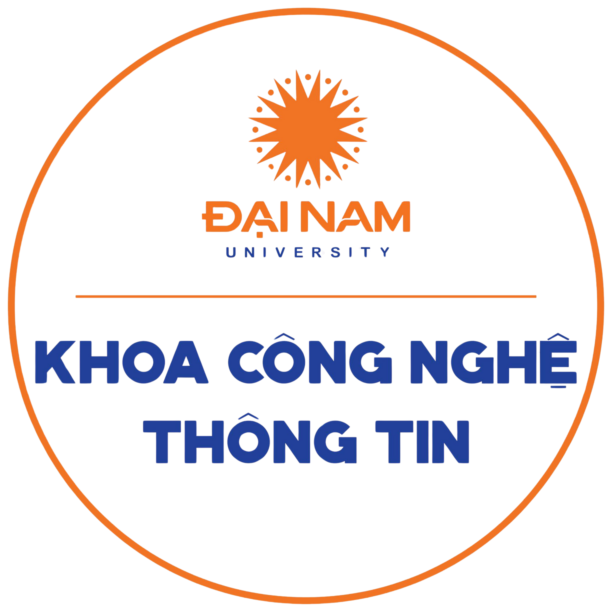

<h2 align="center">
    <a href="https://dainam.edu.vn/vi/khoa-cong-nghe-thong-tin">
    🎓 Faculty of Information Technology (DaiNam University)
    </a>
</h2>
<h2 align="center">
   NETWORK PROGRAMMING
</h2>

    

        
        
        
    

## 📖 1. Giới thiệu
Học phần trang bị cho người học những kiến thức nền tảng của lập trình mạng và các kỹ năng cần thiết để thiết kế và cài đặt các ứng dụng mạng và các chuẩn ở mức ứng dụng dựa trên mô hình Client/Server, có sử dụng các giao tiếp chương trình dựa trên Sockets. Kết thúc học phần, sinh viên có thể viết các chương trình ứng dụng mạng với giao thức tầng ứng dụng tự thiết kế.

## 🔧 2. Ngôn ngữ lập trình sử dụng: 

## 🚀 3. Các project đã thực hiện

### [Khoá 16](./docs/projects/K16/README.md)

## 📝 4. License

© 2025 AIoTLab, Faculty of Information Technology, DaiNam University. All rights reserved.

---
