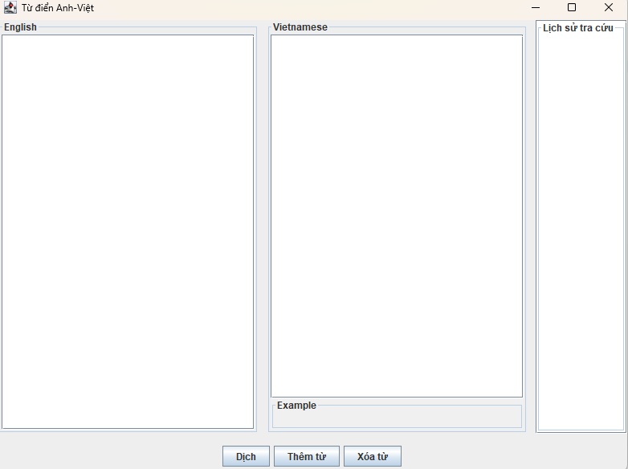
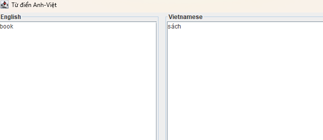
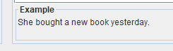

<h2 align="center">
    <a href="https://dainam.edu.vn/vi/khoa-cong-nghe-thong-tin">
    🎓 Faculty of Information Technology (DaiNam University)
    </a>
</h2>
<h2 align="center">
   ỨNG DỤNG HỖ TRỢ TRA CỨU SONG NGỮ ANH-VIỆT. 
</h2>
</h2>

    

        
        
        
    

---

## 📖 1. Giới thiệu.

Ứng dụng được xây dựng theo mô hình **Client–Server**, với các đặc điểm chính:
- **Giao diện:** phát triển bằng **Java Swing**.  
- **Mạng:** trao đổi dữ liệu thông qua **TCP Socket**.  
- **Dữ liệu:** lưu trữ tập trung tại **Server** dưới dạng **SQL Database**.  

Mục tiêu của hệ thống là mang lại trải nghiệm tra cứu từ điển **nhanh chóng, chính xác và thân thiện**, tương tự như Google Dịch nhưng gọn nhẹ hơn.

### ⚡ Các tính năng nổi bật.
- **Tra cứu song ngữ:**  
  - Hỗ trợ cả chế độ Anh→Việt.  
  - Kết quả có thể bao gồm **nhiều nghĩa** và ghi rõ **nguồn tham khảo**.  

- **Ví dụ ngữ cảnh thực tế:**  
  - Mỗi từ vựng có thể kèm theo ví dụ câu (song ngữ nếu có).  
  - Dữ liệu tham khảo từ **StarDict, Wiktionary, Vdict** hoặc các bộ dữ liệu phụ.  

- **Lịch sử tra cứu:**  
  - Server lưu log các truy vấn để hỗ trợ phân tích và mở rộng.  
  - Có thể gắn **User ID** nếu cần quản lý người dùng.  

### 🚀 Giao thức mạng
Hệ thống lựa chọn **TCP Socket** với mục đích:
- Đảm bảo dữ liệu chính xác (tra từ phải **đúng tuyệt đối**).  
- Dễ lập trình với **Java Socket / ServerSocket**.  
- Ổn định cho mô hình **Client–Server**.  

### 🔗 Quy trình hoạt động
1. Client nhập từ cần tra → gửi từ khóa đến Server qua TCP socket.  
2. Server nhận dữ liệu → tra cứu trong cơ sở dữ liệu SQL → trả kết quả.  
3. Client nhận và hiển thị kết quả trên GUI.  
---

## 🔧 2. Công nghệ sử dụng. 
 

---

## 🖼️ 3. Hình ảnh hệ thống.
<h2 align="center">
   Giao diện người dùng.
</h2>

        

<h2 align="center">
   Giao diện dịch.

        

<h2 align="center">
   Giao diện lịch sủ.
</h2>

        

<h2 align="center">
   Giao diện ví dụ.
</h2>

        

---

## ⚙️ 4. Các bước cài đặt.

## Yêu cầu hệ thống

- Java JDK 8 trở lên
- SQL Server 2019/2017/2016
- Eclipse hoặc IDE Java tương thích
- Thư viện JDBC SQL Server (`mssql-jdbc-13.2.0.jre8.jar`)

## Bước 1: Thiết lập cơ sở dữ liệu

1. Mở SQL Server Management Studio (SSMS).
2. New Query rồi copy file `setup_database.txt` vào để tạo database và bảng mẫu.
3. Kiểm tra các bảng:
   - `EV_Dictionary` (English → Vietnamese)
   - `UserLog` (lưu lịch sử tra cứu)
4. Nếu muốn đổi tên user/password, cập nhật trong `config.properties`.

## Bước 2: Cấu hình dự án trong Eclipse

1. Mở Eclipse → File → Import → Existing Projects into Workspace.
2. Chọn thư mục chứa `src/`.
3. Thêm thư viện JDBC:
   - Click phải vào dự án → Build Path → Configure Build Path → Libraries → Add External JAR
   - Chọn `lib/mssql-jdbc-13.2.0.jre8.jar`.
4. Đảm bảo `src` được build → không có lỗi.

## Bước 3: Chạy Server

1. Mở `DictionaryServer.java`.
2. Run → Server sẽ lắng nghe trên port 5000.
3. Kiểm tra log console, đảm bảo kết nối tới DB thành công.

## Bước 4: Chạy Client

1. Mở `DictionaryClient.java`.
2. Run → GUI hiện ra.
3. Nhập từ khóa → nhấn **Dịch** → kết quả hiển thị trong bảng.
4. Lịch sử tra cứu được lưu tự động.

## Bước 5: Cấu hình thêm

- Đổi port server: chỉnh trong `DictionaryServer.java` và `DictionaryClient.java`.
- Thêm từ mới / xóa từ: dùng chức năng trong GUI.
- Nếu dùng AI API (Gemini / GPT) cần cài API key trong `config.properties`.

## Lưu ý

- Đảm bảo SQL Server đang chạy và port TCP 1433 mở.
- Nếu gặp lỗi JDBC SSL: thêm `encrypt=false;trustServerCertificate=true` trong chuỗi kết nối.

---

## 📩 5. Liên hệ.
- 👤 Họ và tên: NGUYỄN TIẾN ĐẠT.
- 🎓 Khoa: Công nghệ Thông tin – Đại học Đại Nam.
- 📧 Email: wayzedgolden@gmail.com
