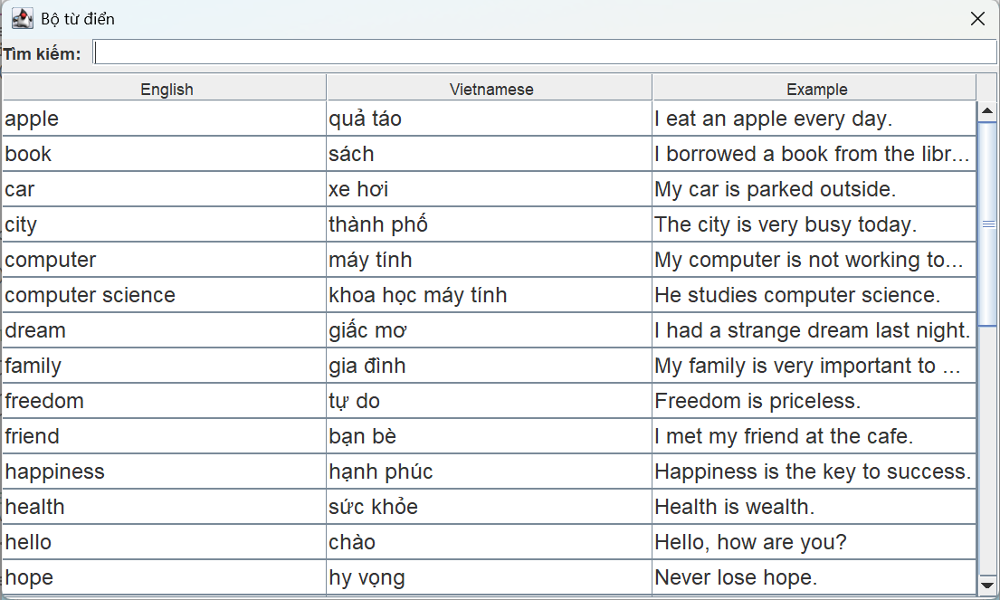
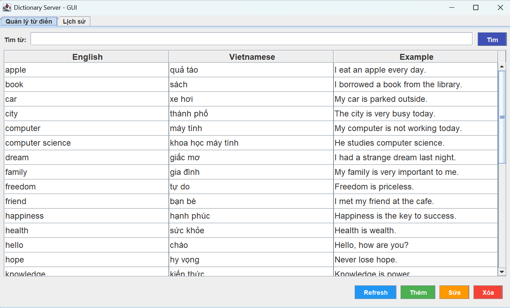
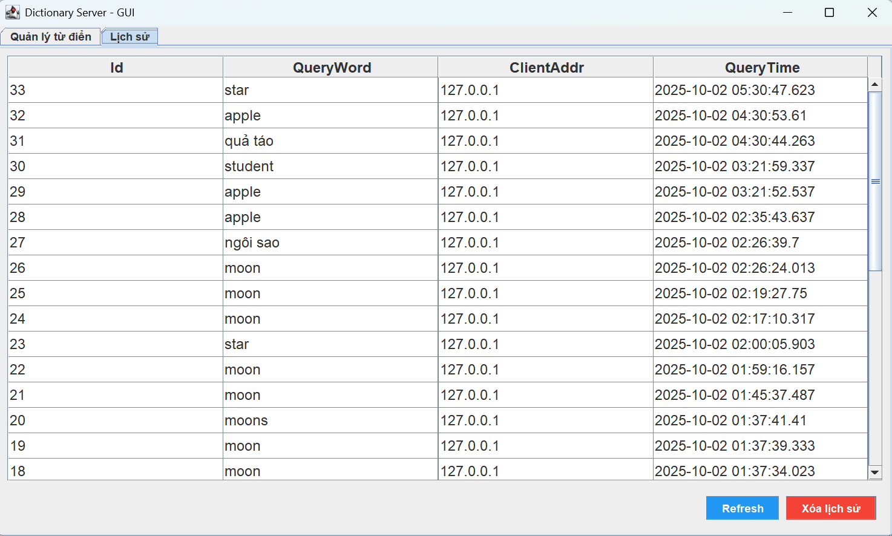

<h2 align="center">
    <a href="https://dainam.edu.vn/vi/khoa-cong-nghe-thong-tin">
    🎓 Faculty of Information Technology (DaiNam University)
    </a>
</h2>
<h2 align="center">
   ỨNG DỤNG HỖ TRỢ TRA CỨU SONG NGỮ ANH-VIỆT. 
</h2>
</h2>

    

        
        
        
    

---

## 📖 1. Giới thiệu.

Ứng dụng được xây dựng theo mô hình **Client–Server**, với các đặc điểm chính:
- **Giao diện:** phát triển bằng **Java Swing**.  
- **Mạng:** trao đổi dữ liệu thông qua **TCP Socket**.  
- **Dữ liệu:** lưu trữ tập trung tại **Server** dưới dạng **SQL Database**.  

Mục tiêu của hệ thống là mang lại trải nghiệm tra cứu từ điển **nhanh chóng, chính xác và thân thiện**, tương tự như Google Dịch nhưng gọn nhẹ hơn.

### ⚡ Các tính năng nổi bật.
- **Tra cứu song ngữ:**  

- **Ví dụ ngữ cảnh thực tế:**  

- **Lịch sử tra cứu:**  

---

## 🔧 2. Công nghệ sử dụng. 
  
  
  

  

---

## 🖼️ 3. Hình ảnh hệ thống.
<h2 align="center">
   *Giao diện người dùng.*
</h2>

        

<h2 align="center">
   *Giao diện bộ từ điển.*

        

<h2 align="center">
   *Giao diện quản lý.*
</h2>

        

<h2 align="center">
   *Giao diện lịch sử.*
</h2>

        

---

## ⚙️ 4. Các bước cài đặt.

Yêu cầu hệ thống

- Java JDK 8 trở lên
- SQL Server 2019/2017/2016
- Eclipse hoặc IDE Java tương thích
- Thư viện JDBC SQL Server (`mssql-jdbc-13.2.0.jre8.jar`)

Bước 1: Thiết lập cơ sở dữ liệu

1. Mở SQL Server Management Studio (SSMS).
2. New Query rồi copy file `setup_database.txt` vào để tạo database và bảng mẫu.

Bước 2: Cấu hình dự án trong Eclipse

1. Mở Eclipse → File → Import → Existing Projects into Workspace.
2. Chọn thư mục chứa `src/`rồi thêm thư viện JDBC:
   - Click phải vào dự án → Build Path → Configure Build Path → Libraries → Add External JAR
   - Chọn `lib/mssql-jdbc-13.2.0.jre8.jar`.

Bước 3: Chạy Server và Client

1. Chạy 2 file `DictionaryServerGUI.java` và `DictionaryClient.java`.
2. Run → Server sẽ lắng nghe trên port 5000.
3. Kiểm tra log console, đảm bảo kết nối tới DB thành công.

---

## 📩 5. Liên hệ.
- 📧 Email: wayzedgolden@gmail.com
